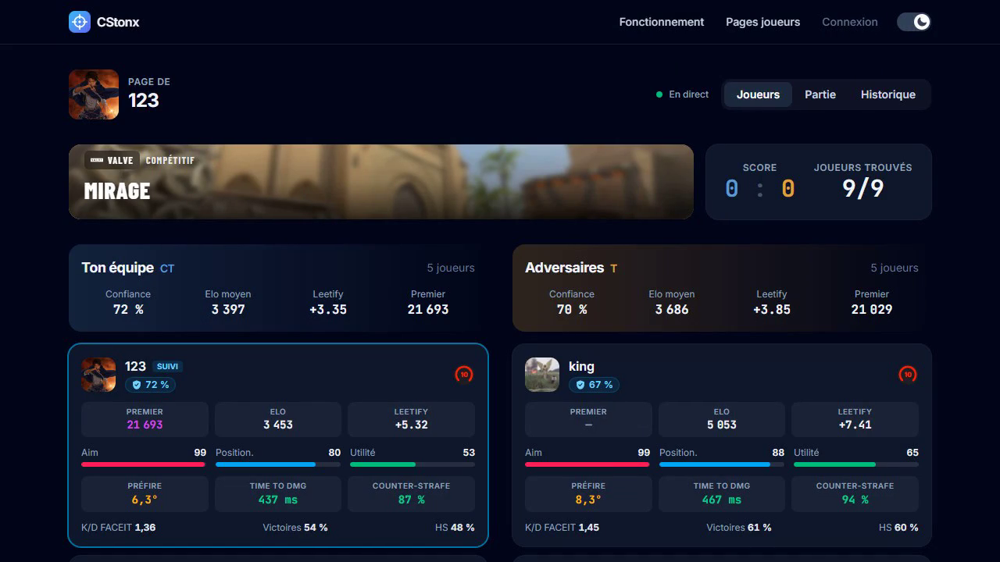
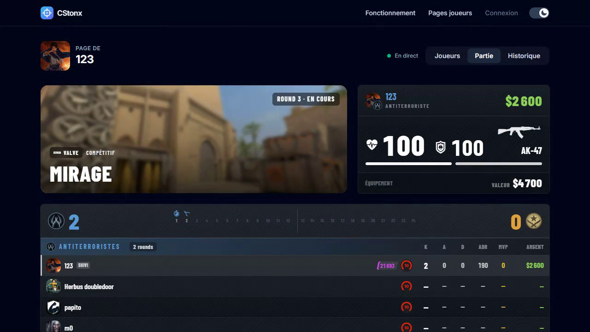

<p align="center">
  
</p>

<h1 align="center">CStonx</h1>

<p align="center">
  <b>Sache contre qui tu joues.</b><br>
  Les stats des 10 joueurs de ta partie CS2, directement dans l'overlay Steam.
</p>

<p align="center">
  <a href="https://github.com/CStonx/download/releases/latest"></a>
  <a href="https://github.com/CStonx/download/releases"></a>
  
  
</p>

<p align="center">
  <a href="https://github.com/CStonx/download/releases/latest"></a>
</p>

<p align="center">
  
</p>

## Ce que fait CStonx

Pendant une partie Premier, Compétitif ou FACEIT, le logiciel repère les joueurs de ta partie, et le site CStonx affiche leurs stats dans le navigateur de l'overlay Steam (**Maj + Tab**).

- **Les 10 joueurs d'un coup** : Leetify, FACEIT, Premier, Steam, et un indice de confiance pour repérer les comptes suspects.
- **La partie en direct** : score, rounds, argent, vie et arme du joueur suivi, stats de fin de match.
- **Aucun risque de ban** : CStonx ne lit pas la mémoire du jeu, n'injecte rien et ne modifie aucun fichier de CS2. Il n'utilise que des fonctionnalités officielles proposées par Valve.
- **Léger** : un seul exe de moins d'1 Mo, qui dort quand il n'y a rien à faire.
- **Mises à jour signées** : le logiciel se met à jour depuis ses Réglages et refuse toute version dont la signature n'est pas valide.

<p align="center">
  
</p>

## Installation

Configuration requise : Windows 10 ou 11 (64 bits), Steam et Counter-Strike 2.

1. Télécharge **`CStonx-Setup-X.Y.Z.exe`** (recommandé) ou **`CStonx-portable.zip`** depuis la [dernière version](https://github.com/CStonx/download/releases/latest).
2. Lance-le. Au premier lancement, Windows peut afficher un avertissement SmartScreen : clique sur **Informations complémentaires**, puis **Exécuter quand même**.
3. Sur le [site CStonx](http://51.38.187.74:7313), connecte-toi avec Steam et **demande l'accès** (l'accès est validé à la main).
4. Une fois validé, récupère ta **clé personnelle** (page « Mon accès » ou Réglages de ta page), colle-la dans le logiciel, onglet **Accueil**, puis **Enregistrer**.
5. Lance CS2 : l'onglet Accueil du logiciel doit afficher **Tout est prêt**.

## Questions fréquentes

<details>
<summary><b>Est-ce que je risque un ban VAC ou FACEIT ?</b></summary>
<br>
Non. CStonx ne touche pas au jeu : pas de lecture de la mémoire, pas d'injection, pas de fichier du jeu modifié. Il n'utilise que des fonctionnalités officielles proposées par Valve.
</details>

<details>
<summary><b>Windows affiche « Windows a protégé votre ordinateur »</b></summary>
<br>
C'est l'avertissement SmartScreen, affiché pour les logiciels encore peu téléchargés. Clique sur <b>Informations complémentaires</b>, puis <b>Exécuter quand même</b>. Tu peux vérifier que ton fichier est bien l'original avec les empreintes ci-dessous.
</details>

<details>
<summary><b>Mon antivirus bloque le fichier</b></summary>
<br>
Certains antivirus se méfient des petits exe récents. Vérifie l'empreinte SHA-256 de ton fichier (section suivante) : si elle correspond, tu peux l'autoriser. Sinon, supprime-le et retélécharge-le depuis cette page uniquement.
</details>

<details>
<summary><b>Rien ne s'affiche pendant ma partie</b></summary>
<br>
Vérifie l'onglet <b>Accueil</b> du logiciel : il indique ce qui manque (clé personnelle, Steam, CS2). Si tout est vert et que rien ne s'affiche, <a href="https://github.com/CStonx/download/issues/new/choose">signale le problème</a>.
</details>

## Vérifier ton téléchargement

Chaque version est accompagnée d'un fichier `SHA256SUMS.txt` avec l'empreinte de chaque fichier. Pour vérifier le tien, dans PowerShell :

```powershell
Get-FileHash .\CStonx-Setup-X.Y.Z.exe -Algorithm SHA256
```

Le résultat doit être identique à la ligne correspondante de `SHA256SUMS.txt` (sans tenir compte des majuscules).

## Désinstaller

- **Version installée** : Paramètres Windows › Applications › CStonx.
- **Version portable** : onglet Counter-Strike 2 › **Tout nettoyer**, puis supprime l'exe.

## Support

- **Un bug ?** [Ouvre un ticket](https://github.com/CStonx/download/issues/new/choose).
- **Une faille de sécurité ?** Lis la [politique de sécurité](SECURITY.md) : ne la publie pas dans un ticket.

---

<p align="center"><sub>
Ce dépôt ne contient que les versions publiées du logiciel. CStonx n'est affilié ni à Valve, ni à FACEIT, ni à Leetify.<br>
Développé par <a href="https://github.com/Thaskow">Thaskow</a> · <a href="LICENSE">Conditions d'utilisation</a>
</sub></p>
